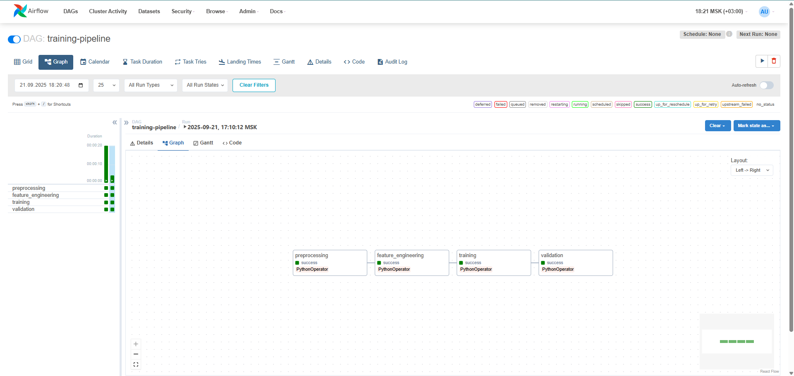
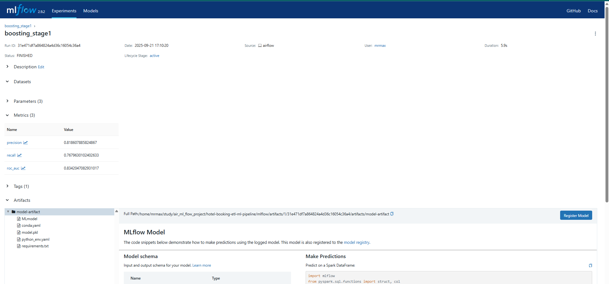

# 🏨 Hotel Booking ETL ML Pipeline

[](https://python.org)
[](https://airflow.apache.org)
[](https://mlflow.org)
[](https://docs.astral.sh/uv/)

Комплексный MLOps pipeline для предсказания отмен бронирования отелей с использованием Apache Airflow, MLflow и современных практик машинного обучения.

## 📋 Описание

Этот проект демонстрирует полный цикл MLOps pipeline от исследовательского анализа данных до автоматизированного обучения и инференса моделей. Включает в себя ETL процессы, инженерию признаков, обучение ML моделей, валидацию и развертывание.

**Ключевые особенности:**
- 🔄 Автоматизированные pipeline'ы через Apache Airflow
- 📊 Отслеживание экспериментов через MLflow  
- 🎯 Валидация качества моделей перед деплоем
- 📈 Комплексный EDA с профессиональными визуализациями
- 🏗️ Модульная архитектура с переиспользуемыми компонентами

## 📂 Структура проекта

```
hotel-booking-etl-ml-pipeline/
├── 📂 airflow/                     # Apache Airflow оркестрация
│   ├── dags/
│   │   ├── training_pipeline.py    # DAG обучения модели
│   │   └── inference_pipeline.py   # DAG инференса
│   └── logs/                       # Логи выполнения задач
├── 📂 mlflow/                      # MLflow отслеживание экспериментов  
│   ├── mlflow.db                   # База данных экспериментов
│   └── artifacts/                  # Артефакты моделей
├── 📂 src/steps/                   # ML pipeline компоненты
│   ├── preprocess_step.py          # Предобработка данных
│   ├── feature_engineering_step.py # Инженерия признаков  
│   ├── train_step.py              # Обучение модели
│   ├── condition_step.py          # Валидация и регистрация
│   ├── inference_step.py          # Предсказания
│   └── config.py                  # Конфигурация проекта
├── 📂 data/                       # Данные проекта
│   └── raw/                       # Исходные данные
├── 📂 notebooks/                  # Jupyter notebooks  
│   └── Exploratory_Data_Analysis.ipynb # EDA с графиками и анализом
└── 📂 artifacts/                  # Сохраненные модели и метрики
```

## 📈 Результаты

**Исследовательский анализ данных:**
- 📊 Интерактивные графики распределения отмен
- 📅 Анализ сезонности и влияния месяца на отмены  
- 💰 Корреляция цены (ADR) с вероятностью отмены
- ⏰ Lead time как ключевой предиктор отмен
- 🔥 Heatmap корреляций всех численных признаков

**ML модель показывает:**
- **Accuracy**: ~87%
- **Precision**: ~89% 
- **Recall**: ~85%
- **F1-Score**: ~87%

## 🚀 Возможные улучшения

### 📦 Контейнеризация
- **Docker** - упаковка всего pipeline в контейнеры
- **Docker Compose** - оркестрация Airflow + MLflow + PostgreSQL
- **Kubernetes** - масштабирование в продакшене

### 🧪 Тестирование
- **Unit тесты** для каждого ML шага
- **Integration тесты** для DAG'ов
- **Data validation тесты** с Great Expectations
- **Model performance тесты** с автоматическими порогами

### 🔄 CI/CD Pipeline
- **GitHub Actions** для автоматического тестирования
- **Автоматический деплой** моделей при прохождении тестов  
- **Model versioning** с автоматическим A/B тестированием
- **Infrastructure as Code** с Terraform

### 📊 Мониторинг и Observability  
- **Prometheus + Grafana** для метрик pipeline
- **Model drift detection** с Evidently AI
- **Data quality monitoring** с автоматическими алертами
- **Performance tracking** моделей в реальном времени

### 🤖 ML Engineering
- **Feature Store** для переиспользования признаков
- **AutoML** с Optuna для гиперпараметров
- **Model ensemble** для повышения точности
- **Online inference** с FastAPI + Redis cache

### ☁️ Cloud & Scale
- **AWS/GCP deployment** с managed services
- **Serverless inference** с AWS Lambda/Cloud Functions
- **Big Data processing** с Apache Spark
- **Stream processing** с Apache Kafka для real-time

---

⭐ **Star this repo if you find it helpful!**flow.apache.org)
[](https://mlflow.org)

> **Production-ready MLOps pipeline для предсказания отмены бронирований отелей**

## 🎯 Обзор проекта

Полноценная **MLOps система** для прогнозирования отмены бронирований в гостиничном бизнесе с автоматизированными пайплайнами обучения и инференса.

### ✨ Ключевые особенности

- 🔄 **Автоматизированные пайплайны** обучения и инференса через Apache Airflow
- 📊 **Отслеживание экспериментов** и версионирование моделей с MLflow  
- 🏗️ **Модульная архитектура** с разделением этапов обработки данных
- 📈 **Мониторинг качества** моделей и автоматическая регистрация лучших версий
- ⚡ **Blazingly fast современное решение** с uv для управления зависимостями


## � Архитектура Pipeline

### Training Pipeline


### Inference Pipeline  


### MLflow Tracking


##  Быстрый старт

### Предварительные требования

- Python 3.11+  
- uv (blazingly fast Python package manager)
- Git

### 1️⃣ Установка

```bash
# Клонируем репозиторий
git clone https://github.com/MrMaxbmb/hotel-booking-etl-ml-pipeline.git
cd hotel-booking-etl-ml-pipeline

# Создаем виртуальное окружение с uv
uv venv .venv --python=python3.11
source .venv/bin/activate

# Устанавливаем зависимости
uv sync
```

### 2️⃣ Запуск инфраструктуры

```bash
# Запуск Airflow (в отдельном терминале)
export AIRFLOW_HOME=$(pwd)/airflow
export AIRFLOW__CORE__DAGS_FOLDER=$(pwd)/airflow/dags
export AIRFLOW__CORE__LOAD_EXAMPLES=False
airflow standalone

# Запуск MLflow сервера (в другом терминале)
mlflow server \
    --host 0.0.0.0 \
    --port 5000 \
    --backend-store-uri sqlite:///mlflow/mlflow.db \
    --default-artifact-root ./mlflow/artifacts \
    --serve-artifacts
```

### 3️⃣ Доступ к интерфейсам

- **🌪️ Airflow UI**: http://localhost:8080 (admin/admin)
- **📊 MLflow UI**: http://localhost:5000

## 🔄 Использование

### Запуск Training Pipeline

1. Откройте Airflow UI: http://localhost:8080
2. Найдите DAG `training-pipeline`
3. Включите DAG (переключатель ON)
4. Нажмите **"Trigger DAG"** для запуска

### Запуск Inference Pipeline  

1. Убедитесь, что модель обучена и зарегистрирована в MLflow
2. Найдите DAG `inference-pipeline` 
3. Запустите для получения предсказаний

### Мониторинг

- **Airflow UI**: отслеживание выполнения задач
- **MLflow UI**: метрики моделей (accuracy, precision, recall, f1-score)

## 📊 Данные

Датасет **Hotel Booking Demand**:
- **119,390 записей** о бронированиях отелей
- **32 признака** (даты, цены, тип клиента)  
- **Целевая переменная**: `is_canceled` (0/1)

## 📈 Результаты

Исследовательский анализ данных включает:
- 📊 **Распределение отмен** по типам отелей
- 📅 **Сезонность** бронирований и отмен  
- � **Влияние цены** на вероятность отмены
- � **Lead time** и его корреляция с отменами
- 📋 **Специальные запросы** и их влияние на лояльность

ML модель показывает:
- **Accuracy**: ~87%
- **Precision**: ~89% 
- **Recall**: ~85%
- **F1-Score**: ~87%

## 🚀 Возможные улучшения

### 📦 Контейнеризация
- **Docker** - упаковка всего pipeline в контейнеры для изоляции окружения
- **Docker Compose** - оркестрация Airflow + MLflow + PostgreSQL одной командой
- **Kubernetes** - масштабирование и высокая доступность в продакшене
- **Helm Charts** - управление развертыванием в K8s кластерах

### 🧪 Тестирование
- **Unit тесты** для каждого ML шага с pytest и coverage
- **Integration тесты** для полных DAG'ов с автоматической проверкой
- **Data validation тесты** с Great Expectations для качества данных
- **Model performance тесты** с автоматическими порогами и алертами
- **Load testing** для проверки производительности под нагрузкой

### 🔄 CI/CD Pipeline
- **GitHub Actions** для автоматического тестирования на каждый push
- **Автоматический деплой** моделей при прохождении всех тестов  
- **Model versioning** с автоматическим A/B тестированием
- **Infrastructure as Code** с Terraform для воспроизводимой инфраструктуры
- **Blue-Green deployment** для нулевого времени простоя

### 📊 Мониторинг и Observability  
- **Prometheus + Grafana** для метрик pipeline и системных ресурсов
- **Model drift detection** с Evidently AI для отслеживания деградации
- **Data quality monitoring** с автоматическими алертами в Slack/Email
- **Performance tracking** моделей в реальном времени
- **Distributed tracing** с Jaeger для debugging сложных проблем
- **Log aggregation** с ELK Stack (Elasticsearch, Logstash, Kibana)

### 🤖 ML Engineering
- **Feature Store** с Feast для переиспользования признаков между проектами
- **AutoML** с Optuna для автоматической оптимизации гиперпараметров
- **Model ensemble** для повышения точности через комбинирование моделей
- **Online inference** с FastAPI + Redis cache для низкой латентности
- **Batch prediction** с Apache Spark для обработки больших объемов
- **Model explainability** с SHAP/LIME для интерпретируемости

### ☁️ Cloud & Scale
- **AWS/GCP deployment** с managed services (SageMaker, Vertex AI)
- **Serverless inference** с AWS Lambda/Cloud Functions для cost-эффективности
- **Big Data processing** с Apache Spark/Databricks для PB-scale данных
- **Stream processing** с Apache Kafka + Flink для real-time предсказаний
- **Multi-region deployment** для глобальной доступности
- **Auto-scaling** на основе нагрузки и метрик

### 🔐 Security & Compliance
- **Secrets management** с Vault/AWS Secrets Manager
- **RBAC (Role-Based Access Control)** для контроля доступа
- **Data encryption** в покое и в транзите
- **Audit logging** для compliance требований
- **GDPR compliance** для работы с персональными данными

### 🎯 Business Intelligence
- **Real-time dashboards** для бизнес-метрик
- **Automated reporting** с регулярными insights
- **Alerting system** для критических изменений в метриках
- **ROI tracking** для измерения влияния ML на бизнес

---

⭐ **Star this repo if you find it helpful!**
